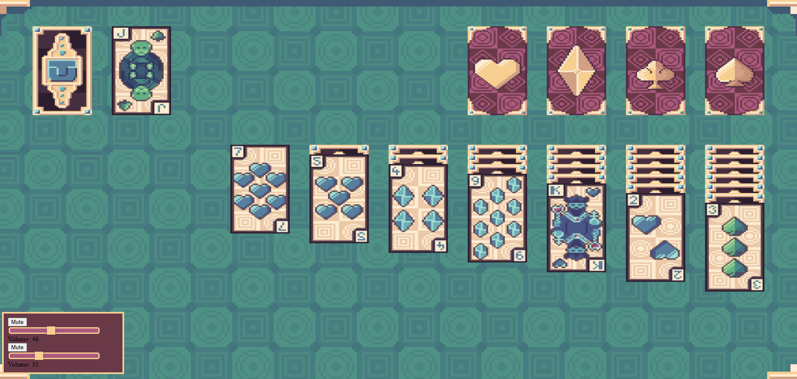

# Solitaire
A browser-based Klondike-style 3D Solitaire game created with JavaScript and Three.js.

The game renders the table, playing cards and card animations in a WebGL scene. It uses an orthographic camera to create a clean tabletop view while still allowing cards to move, flip and stack in three-dimensional space.

## Play Online

[](https://kristian-kocis.github.io/Solitaire/)

## Features

- Randomly shuffled 52-card deck
- Four foundation piles built by suit from Ace to King
- Automatic flipping of newly uncovered tableau cards
- Mouse-based drag-and-drop controls
- Animated card movement and flipping
- Sound effects for turning, lifting, dropping and shuffling cards
- Background music with separate mute and volume controls
- Victory detection, victory animation and game restart

## Technologies

- **JavaScript**
- **HTML5**
- **CSS3**
- **Three.js**
- **WebGL**

## Usage

### Draw pile

Click the face-down deck to reveal the next card. When the draw pile is empty, click its placeholder to return the revealed cards to the deck.

### Tableau

Drag a face-up card onto a card of the opposite colour and one rank higher.

Examples:

- Red 7 onto black 8
- Black Queen onto red King

A valid sequence of face-up cards can be moved together. Only a King can be moved to an empty tableau pile.

### Foundation piles

Move cards to the matching suit pile in ascending order:

```text
Ace → 2 → 3 → ... → Queen → King
```

The game is won when all four foundation piles contain 13 cards.

### Audio controls

The controls at the top of the page allow you to:

- Mute or unmute sound effects
- Change the sound-effect volume
- Mute or unmute background music
- Change the music volume

## Screenshots


